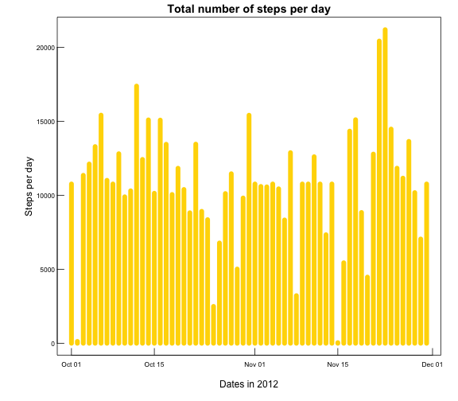

# Reproducible Research: Peer Assessment 1


## Loading and preprocessing the data

We assume that the data is present in the workspace. If not, the data should be loaded and unzipped into the workspace. We load the data into our environment:


```r
data<-read.csv("activity.csv")
```
 
Let's take a look at the data:


```r
str(data)
```

```
## 'data.frame':	17568 obs. of  3 variables:
##  $ steps   : int  NA NA NA NA NA NA NA NA NA NA ...
##  $ date    : Factor w/ 61 levels "2012-10-01","2012-10-02",..: 1 1 1 1 1 1 1 1 1 1 ...
##  $ interval: int  0 5 10 15 20 25 30 35 40 45 ...
```
 
We transform the date column into date-types:


```r
data$date<-as.Date(as.character(data$date))
```
 
And check the data again, to verify that our transformation worked:


```r
str(data)
```

```
## 'data.frame':	17568 obs. of  3 variables:
##  $ steps   : int  NA NA NA NA NA NA NA NA NA NA ...
##  $ date    : Date, format: "2012-10-01" "2012-10-01" ...
##  $ interval: int  0 5 10 15 20 25 30 35 40 45 ...
```


## What is mean total number of steps taken per day?

We sum the number of steps per day and plot the histogram:


```r
library(plyr)
spd<-ddply(data, .(date), summarize, steps_per_day = sum(steps))
spd_cc<-na.omit(spd)
par(mar=c(4,5,1.5,1.5))
with(spd_cc, plot(date,steps_per_day, type="h", 
                  lwd=8, col="gold", main="Total number of steps per day",
                  xlab="Dates in 2012", ylab="Steps per day", cex.axis=0.7,
                  las=1,mgp=c(2,0.2,0), tck=0.02))
```

 


Calculation of the mean and median total number of steps per day:


```r
df<-ddply(data, .(date), summarize,mean_value = mean(steps, na.rm=TRUE), 
          median_value = median(steps, na.rm=TRUE))
colnames(df)<-c("Date", "Mean", "Median")
print.data.frame(df, right=FALSE, row.names=FALSE)
```

```
##  Date       Mean    Median
##  2012-10-01     NaN NA    
##  2012-10-02  0.4375  0    
##  2012-10-03 39.4167  0    
##  2012-10-04 42.0694  0    
##  2012-10-05 46.1597  0    
##  2012-10-06 53.5417  0    
##  2012-10-07 38.2465  0    
##  2012-10-08     NaN NA    
##  2012-10-09 44.4826  0    
##  2012-10-10 34.3750  0    
##  2012-10-11 35.7778  0    
##  2012-10-12 60.3542  0    
##  2012-10-13 43.1458  0    
##  2012-10-14 52.4236  0    
##  2012-10-15 35.2049  0    
##  2012-10-16 52.3750  0    
##  2012-10-17 46.7083  0    
##  2012-10-18 34.9167  0    
##  2012-10-19 41.0729  0    
##  2012-10-20 36.0938  0    
##  2012-10-21 30.6285  0    
##  2012-10-22 46.7361  0    
##  2012-10-23 30.9653  0    
##  2012-10-24 29.0104  0    
##  2012-10-25  8.6528  0    
##  2012-10-26 23.5347  0    
##  2012-10-27 35.1354  0    
##  2012-10-28 39.7847  0    
##  2012-10-29 17.4236  0    
##  2012-10-30 34.0938  0    
##  2012-10-31 53.5208  0    
##  2012-11-01     NaN NA    
##  2012-11-02 36.8056  0    
##  2012-11-03 36.7049  0    
##  2012-11-04     NaN NA    
##  2012-11-05 36.2465  0    
##  2012-11-06 28.9375  0    
##  2012-11-07 44.7326  0    
##  2012-11-08 11.1771  0    
##  2012-11-09     NaN NA    
##  2012-11-10     NaN NA    
##  2012-11-11 43.7778  0    
##  2012-11-12 37.3785  0    
##  2012-11-13 25.4722  0    
##  2012-11-14     NaN NA    
##  2012-11-15  0.1424  0    
##  2012-11-16 18.8924  0    
##  2012-11-17 49.7882  0    
##  2012-11-18 52.4653  0    
##  2012-11-19 30.6979  0    
##  2012-11-20 15.5278  0    
##  2012-11-21 44.3993  0    
##  2012-11-22 70.9271  0    
##  2012-11-23 73.5903  0    
##  2012-11-24 50.2708  0    
##  2012-11-25 41.0903  0    
##  2012-11-26 38.7569  0    
##  2012-11-27 47.3819  0    
##  2012-11-28 35.3576  0    
##  2012-11-29 24.4688  0    
##  2012-11-30     NaN NA
```

## What is the average daily activity pattern?

```r
av_per_int_df<-ddply(data, .(interval), summarize, ave_per_interval = mean(steps, na.rm=TRUE))
av_per_in_df_cc<-na.omit(av_per_int_df)
with(av_per_in_df_cc, plot( interval,ave_per_interval, type="l",
                           xlab="Interval", ylab="Average Steps Per Interval",
                           main="Average Daily Activity Pattern"))
```

 

We find the interval with the highest average number of steps:


```r
which.max(av_per_in_df_cc$ave_per_interval)
```

[1] 104

## Inputing missing values

We start off by calculating missing values:

```r
isna<-count(is.na(data$steps))
isna[2,2]
```

```
## [1] 2304
```

The substitution strategy we will use is very simple. We will replece each NA with the average value for that interval. We will use the averages as is, that is, there will be no casting of the values to integers. We make a dataframe where NA's are substituded with the average for that interval.


```r
merged_df = merge(data, av_per_in_df_cc, by="interval")

for(n in 1:length(merged_df$steps)){
  if(is.na(merged_df[n,'steps'])){merged_df[n,'steps']<-merged_df[n,'ave_per_interval']}  
}
new_data<-merged_df[order(merged_df$date),]
new_data<-new_data[c("steps", "date", "interval")]
```

And we take a look the head of the resulting dataframe:


```r
head(new_data)
```

```
##       steps       date interval
## 1   1.71698 2012-10-01        0
## 63  0.33962 2012-10-01        5
## 128 0.13208 2012-10-01       10
## 205 0.15094 2012-10-01       15
## 264 0.07547 2012-10-01       20
## 327 2.09434 2012-10-01       25
```

We now take a look at the head of the original data for comparison:


```r
head(data)
```

```
##   steps       date interval
## 1    NA 2012-10-01        0
## 2    NA 2012-10-01        5
## 3    NA 2012-10-01       10
## 4    NA 2012-10-01       15
## 5    NA 2012-10-01       20
## 6    NA 2012-10-01       25
```

We see that the new_data no longer has the NA values.

The next step is to sum the data and plot the histogram for the new dataset:


```r
n_spd<-ddply(new_data, .(date), summarize, n_steps_per_day = sum(steps))
par(mar=c(4,5,1.5,1.5))
with(n_spd, plot(date,n_steps_per_day, type="h", 
                  lwd=8, col="gold", main="Total number of steps per day",
                  xlab="Dates in 2012", ylab="Steps per day", cex.axis=0.7,
                  las=1,mgp=c(2,0.2,0), tck=0.02))
```

 

Calculation of the mean and median total number of steps per day for the new dataset:


```r
n_df<-ddply(new_data, .(date), summarize,mv = mean(steps, na.rm=TRUE), 
          medv = median(steps, na.rm=TRUE))
colnames(n_df)<-c("Date", "Mean", "Median")
print.data.frame(n_df, right=FALSE, row.names=FALSE)
```

```
##  Date       Mean    Median
##  2012-10-01 37.3826 34.11 
##  2012-10-02  0.4375  0.00 
##  2012-10-03 39.4167  0.00 
##  2012-10-04 42.0694  0.00 
##  2012-10-05 46.1597  0.00 
##  2012-10-06 53.5417  0.00 
##  2012-10-07 38.2465  0.00 
##  2012-10-08 37.3826 34.11 
##  2012-10-09 44.4826  0.00 
##  2012-10-10 34.3750  0.00 
##  2012-10-11 35.7778  0.00 
##  2012-10-12 60.3542  0.00 
##  2012-10-13 43.1458  0.00 
##  2012-10-14 52.4236  0.00 
##  2012-10-15 35.2049  0.00 
##  2012-10-16 52.3750  0.00 
##  2012-10-17 46.7083  0.00 
##  2012-10-18 34.9167  0.00 
##  2012-10-19 41.0729  0.00 
##  2012-10-20 36.0938  0.00 
##  2012-10-21 30.6285  0.00 
##  2012-10-22 46.7361  0.00 
##  2012-10-23 30.9653  0.00 
##  2012-10-24 29.0104  0.00 
##  2012-10-25  8.6528  0.00 
##  2012-10-26 23.5347  0.00 
##  2012-10-27 35.1354  0.00 
##  2012-10-28 39.7847  0.00 
##  2012-10-29 17.4236  0.00 
##  2012-10-30 34.0938  0.00 
##  2012-10-31 53.5208  0.00 
##  2012-11-01 37.3826 34.11 
##  2012-11-02 36.8056  0.00 
##  2012-11-03 36.7049  0.00 
##  2012-11-04 37.3826 34.11 
##  2012-11-05 36.2465  0.00 
##  2012-11-06 28.9375  0.00 
##  2012-11-07 44.7326  0.00 
##  2012-11-08 11.1771  0.00 
##  2012-11-09 37.3826 34.11 
##  2012-11-10 37.3826 34.11 
##  2012-11-11 43.7778  0.00 
##  2012-11-12 37.3785  0.00 
##  2012-11-13 25.4722  0.00 
##  2012-11-14 37.3826 34.11 
##  2012-11-15  0.1424  0.00 
##  2012-11-16 18.8924  0.00 
##  2012-11-17 49.7882  0.00 
##  2012-11-18 52.4653  0.00 
##  2012-11-19 30.6979  0.00 
##  2012-11-20 15.5278  0.00 
##  2012-11-21 44.3993  0.00 
##  2012-11-22 70.9271  0.00 
##  2012-11-23 73.5903  0.00 
##  2012-11-24 50.2708  0.00 
##  2012-11-25 41.0903  0.00 
##  2012-11-26 38.7569  0.00 
##  2012-11-27 47.3819  0.00 
##  2012-11-28 35.3576  0.00 
##  2012-11-29 24.4688  0.00 
##  2012-11-30 37.3826 34.11
```

## Are there differences in activity patterns between weekdays and weekends?

We start out by making a new column which gives the day of the week:


```r
new_data$weekdays<-weekdays(new_data$date)
```

And we take a look at the head and tail of the data frame:


```r
head(new_data)
```

```
##       steps       date interval weekdays
## 1   1.71698 2012-10-01        0   Monday
## 63  0.33962 2012-10-01        5   Monday
## 128 0.13208 2012-10-01       10   Monday
## 205 0.15094 2012-10-01       15   Monday
## 264 0.07547 2012-10-01       20   Monday
## 327 2.09434 2012-10-01       25   Monday
```

```r
tail(new_data)
```

```
##        steps       date interval weekdays
## 17242 2.6038 2012-11-30     2330   Friday
## 17305 4.6981 2012-11-30     2335   Friday
## 17364 3.3019 2012-11-30     2340   Friday
## 17441 0.6415 2012-11-30     2345   Friday
## 17506 0.2264 2012-11-30     2350   Friday
## 17568 1.0755 2012-11-30     2355   Friday
```

The "weekday" column is an temporary column that we will use to generate a column with the weekday/weekend factors. This column is called "day", for a lack of better name. The code listing follows, along with a look at the head of the resulting dataframe:


```r
for(n in 1:length(new_data$weekdays)){
  if(new_data$weekdays[n] == 'Saturday' | new_data$weekdays[n] =='Sunday') {
    new_data$day[n]<-"weekend" }
  else new_data$day[n]<-"weekday" 
}
new_data$day<-as.factor(new_data$day)
head(new_data)
```

```
##       steps       date interval weekdays     day
## 1   1.71698 2012-10-01        0   Monday weekday
## 63  0.33962 2012-10-01        5   Monday weekday
## 128 0.13208 2012-10-01       10   Monday weekday
## 205 0.15094 2012-10-01       15   Monday weekday
## 264 0.07547 2012-10-01       20   Monday weekday
## 327 2.09434 2012-10-01       25   Monday weekday
```


We then plot the activities based on the weekdays/weekend factors:


```r
library(lattice)
xyplot(steps ~ interval | day, data=new_data, type="l", 
       layout=c(1,2), xlab="Interval", ylab="Number of Steps")
```

 

